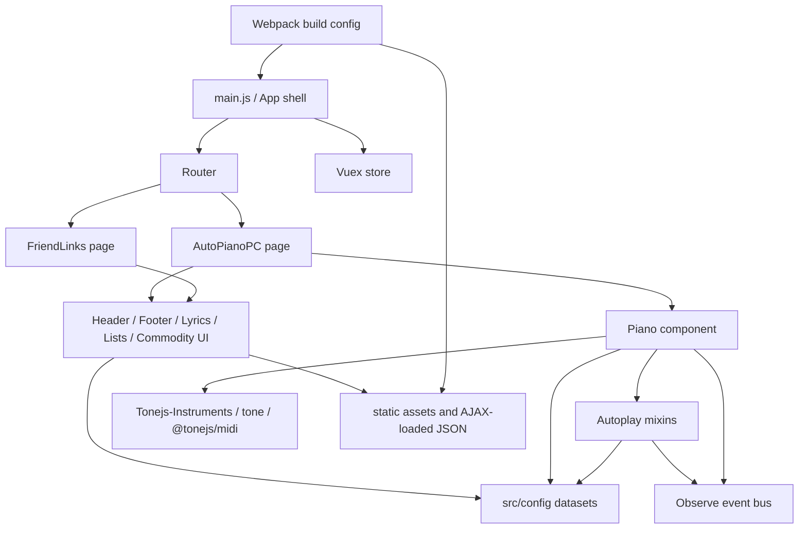
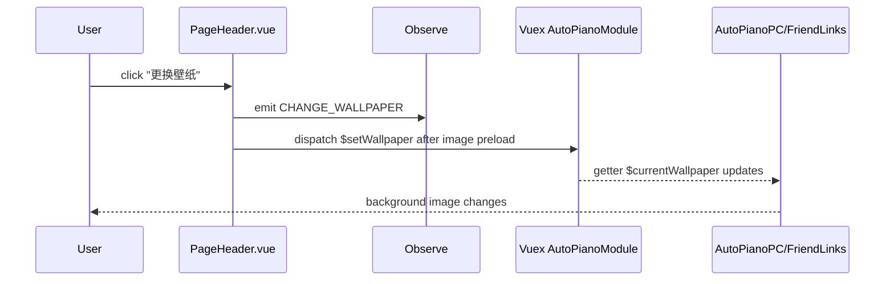
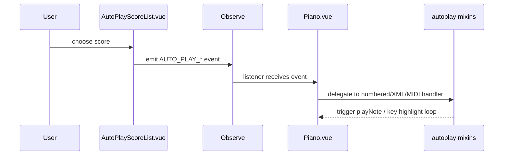

# Dependencies

Verified at: 2026-03-23

Most relationships below are inferred from file imports and component registration during manual inspection. Raw AST output did not recover internal import edges for this repository.

## System Dependency Graph

## Practical Dependency Notes

- `src/main.js` imports the root app, store, and router.
- `src/router/index.js` lazy-loads `AutoPianoPC` and `FriendLinks`.
- `AutoPianoPC.vue` composes the main page from header, piano, two score lists, footer, and commodity list.
- `FriendLinks.vue` shares header/footer and consumes `Links` plus wallpaper state.
- `PageHeader.vue` drives wallpaper changes through `Observe` and the Vuex wallpaper action.
- `Piano.vue` is the hub for playback behavior and mixes in all autoplay implementations.
- `AutoPlayScoreList.vue` emits events that trigger numbered score, MIDI, or MusicXML playback.
- `ManualPlayScoreList.vue` is isolated from playback and acts as a read-only training catalog.
- `CommodityList.vue` falls back to `src/config/goods.js` and then overwrites with AJAX-loaded `/static/data/goods.json` if present.

## Key Flows

### Wallpaper flow

### Autoplay flow

## Coupling Warnings From Git

- `config/index.js` co-changes heavily with `index.html`, `src/config/scorexml.js`, `src/config/wallpaper.js`, and `src/lib/Tonejs-Instruments.js`.
- `src/components/Piano.vue` co-changes with `src/router/index.js`, `src/config/index.js`, and `src/components/Footer.vue`.
- `package.json` and `yarn.lock` move together, as expected for dependency edits.

These are change-risk hints, not proof of runtime dependency.
